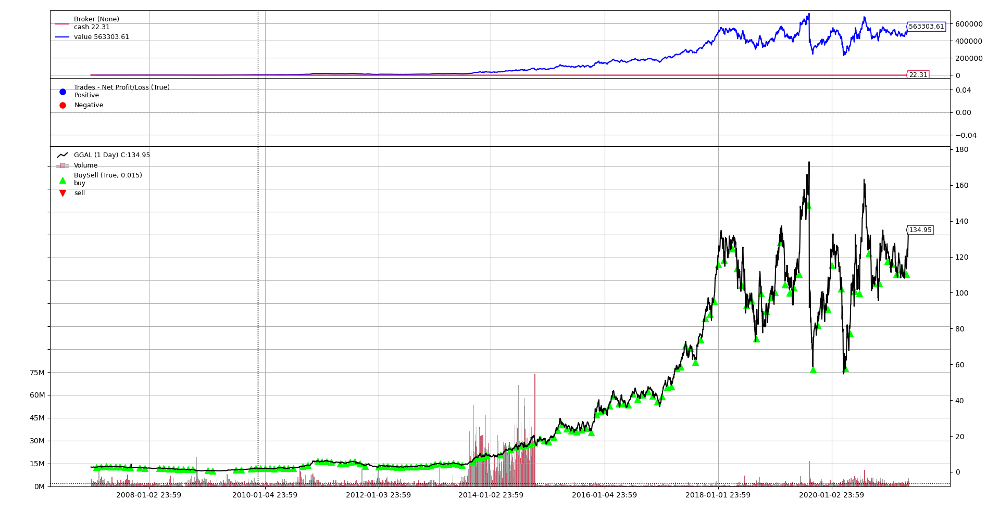

# Backtrader
First attempt of trading strategies testing with Python [Backtrader](https://www.backtrader.com/) module.

# Installation
Just clone the repo to your PC with:
``` 
git clone https://github.com/DMC1988/Backtrader.git
```
then:
```
pip install -r req.txt
```
# Getting started
Data is directly pulled from Yahoo Finance. Note the ticker('KO'), the timeframe('Days') and the time interval('fromdate' and 'todate').
```Python
data = bt.feeds.YahooFinanceData(
    dataname='KO',    # Ticker
    timeframe=bt.TimeFrame.Days, compression=1,
    # Do not pass values before this date
    fromdate=dt.datetime(2007, 1, 1),
    # Do not pass values after this date
    todate=dt.datetime(2021, 5, 20),
    reverse=False)
```
In the next two lines the initial amount of cash to invest is set and the strategy to run is chosen.
```Python
cerebro.broker.setcash(1000)  # Available cash to invest
cerebro.addstrategy(strg.BuyAndHold_More_Fund)  # Load strategy to 
```
If you want to try wmaStrategy the following line must be uncomment to allow Cerebro to use two timeframes, daily and weekly.
```Python
#cerebro.resampledata(data, timeframe=bt.TimeFrame.Weeks)  # Resampling data to week interval
```
## Example


# Author
Damian Caputo - [LinkedIn](https://www.linkedin.com/in/damian-caputo/) - damian.m.caputo@gmail.com

Electronic engineer, science and finance enthusiast taking his first steps in python and imporoving his programming skills.
